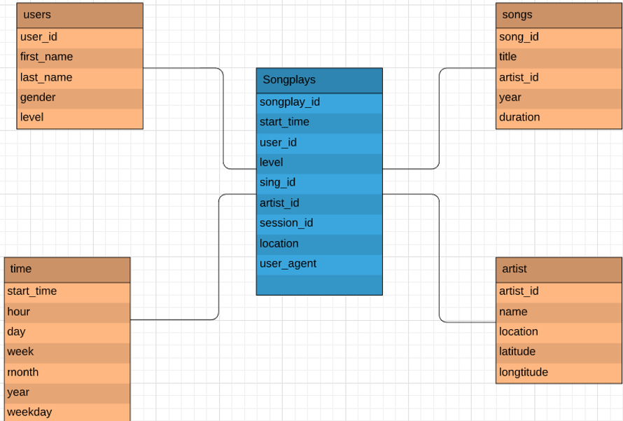
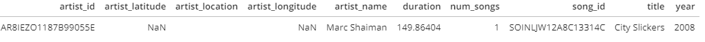

# Data Modeling With Postgres...

### Introduction

Hey there i'm Mohammed Alsuliman and i'll talk about Data Modeling With Postgre Project, First let us know what is the Sparkify ? Sparkify is a music app and i as a Data Engineering will create and make the Postgres database and the ETL pipline to optimize Queries. to help the Sparkify team to analysis the data.

### DataBase Schema
As you can see here There are 5 Tables:

- SongPlays table which is the fact Table
- The Other Tables are Dimentions Tables

### ETL Pipeline

#### The Dataset

the dataset comes from a json files contains data about a song and the artists of that song,
so the path of that files are like this : song_data/A/B/C/TRABCRU128F423F449.json',

If we extract the data from that file we get as follows :

### Find Songs

I Wrote this query to find the songs:

song_select =("""
SELECT songs.song_id, artists.artist_id
FROM songs JOIN artists ON songs.artist_id = artists.artist_id
WHERE songs.title = %s AND artists.name=%s AND songs.duration=%s
""")

as you can see i found the songs that rely on the Title, Name and Duration.